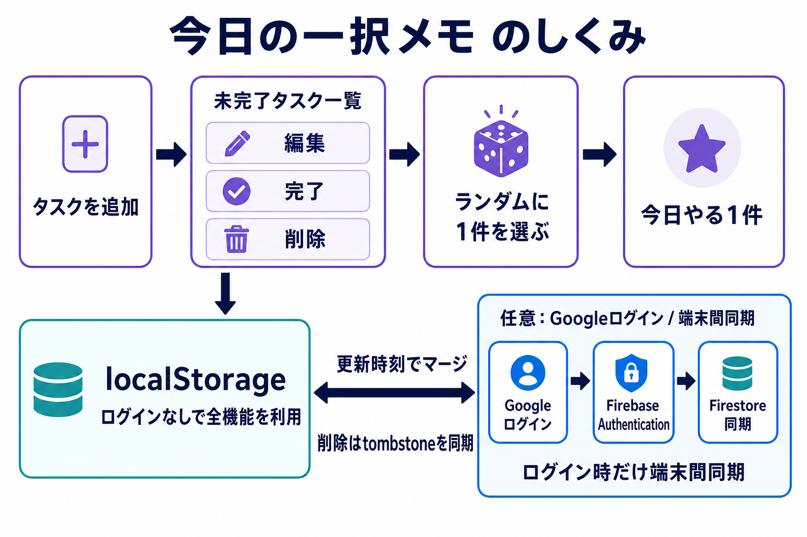

# 今日の一択メモ / task-picker

[](https://github.com/misaka310/task-picker/actions/workflows/ci.yml)

タスクを追加して、未完了タスクからランダムに1件を決めるシンプルなメモアプリです。
未ログインでもブラウザ内に保存でき、必要な場合だけGoogleログインでFirebaseへ同期できます。

<p align="center">
  
</p>

ログインなしのローカル利用と、任意のGoogleログインによる端末間同期を分けて示しています。

## Demo

https://task-picker.onrender.com/

## 主な機能

- タスクの追加、編集、完了、削除
- 未完了タスクからランダムに1件を選択
- 未ログイン時は `localStorage` に保存
- Googleログイン後は Firebase Authentication + Firestore に同期
- ログイン時、端末内のローカルデータとFirestoreを競合解決して統合

## 起動

Node.js 22以上が必要です。

```bash
npm run dev
```

ブラウザで `http://localhost:3000` を開きます。

## 保存と同期

未ログインではブラウザ内だけに保存され、Googleログイン後はFirebaseへ同期します。ログイン時は端末内のタスクを破棄せず、Firestoreのデータと更新時刻を比較して統合します。

複数端末で同じタスクを編集・削除した場合の競合ルールは[同期仕様](docs/sync.md)を参照してください。

## 静的サイトとしてのビルド

```bash
npm run build
```

`dist/` に静的ファイルを出力します。
Render Static Site では `server.mjs` は実行されないため、Firebase設定はアクセス時ではなくビルド時に `dist/firebase-client-settings.js` へ生成します。

## 開発と検証

```bash
npm run lint
npm run typecheck
npm test
npm run build
```

`npm test`はNode.jsのV8 coverageを使用し、同期中核に80%のline coverageを要求します。GitHub Actionsではlint、型検査、競合解決テスト、静的ビルドをpull requestごとに実行します。

## Firebase設定

初期状態では `firebase-client-settings.js` が `export const firebaseConfig = null;` なので、ローカル保存のみで動きます。
GitHubにはFirebase実値を書かず、リポジトリ直下の `firebase-client-settings.js` は `export const firebaseConfig = null;` のまま維持します。

Render Static SiteでFirebase同期を使う場合は、RenderのEnvironment Variablesに以下を設定します。6つすべてが設定されている場合だけ、`npm run build` が `dist/firebase-client-settings.js` にFirebase Web configを生成します。1つでも不足している場合は `export const firebaseConfig = null;` を生成します。

- `PUBLIC_FIREBASE_API_KEY`
- `PUBLIC_FIREBASE_AUTH_DOMAIN`
- `PUBLIC_FIREBASE_PROJECT_ID`
- `PUBLIC_FIREBASE_STORAGE_BUCKET`
- `PUBLIC_FIREBASE_MESSAGING_SENDER_ID`
- `PUBLIC_FIREBASE_APP_ID`

Firebase Web configはブラウザでFirebaseを使うための公開設定です。GitHubには書かずRenderのビルド時だけ使いますが、公開サイトの `/firebase-client-settings.js` からは見えます。保護する本体はFirestore Security Rules、Authentication設定、API key制限です。

### ローカルでFirebase同期を試す

`npm run dev`で起動する`server.mjs`も、Renderと同じ6つの環境変数（`PUBLIC_FIREBASE_*`）からFirebase Web configを動的に生成します。ローカル端末のシェルでこれらを設定してから`npm run dev`を起動すれば、`http://localhost:3000/firebase-client-settings.js`が同様にobjectを返し、Firebase同期を確認できます。設定しない場合は`export const firebaseConfig = null;`を返し、ローカル保存のみで動作します。

## Render Static Site 設定

Renderの対象サービスをStatic Siteとして運用する場合は以下にします。

- Build Command: `npm run build`
- Publish Directory: `dist`
- Environment Variables: 上記6個を設定

環境変数を変更した後は再デプロイします。デプロイ後に以下を開き、`null` ではなくobjectが返ればRenderの環境変数は反映されています。

```txt
https://task-picker.onrender.com/firebase-client-settings.js
```

`export const firebaseConfig = null;` のままなら、Renderの環境変数不足、Build Command未設定、Publish Directory未設定、または再デプロイ未実施です。

## Firebase Console 側の設定

Firebase Console 側で以下を有効化します。

1. Authentication > Sign-in method > Google
2. Authentication > Settings > Authorized domains に `task-picker.onrender.com` を追加
3. Firestore Database

## Firestore Security Rules 例

```txt
rules_version = '2';
service cloud.firestore {
  match /databases/{database}/documents {
    match /users/{userId}/items/{itemId} {
      allow read, write: if request.auth != null && request.auth.uid == userId;
    }
  }
}
```

## 動作確認

- `npm run dev` で `http://localhost:3000` が開けること
- `npm run build` で `dist/` が生成されること
- Render Static Site のBuild Commandが `npm run build` になっていること
- Render Static Site のPublish Directoryが `dist` になっていること
- 未ログイン状態で追加・決定・完了・編集・削除ができること
- リロード後もローカル保存データが残ること
- Render環境変数設定後、`/firebase-client-settings.js` がobjectを返すこと
- Googleログインできること
- 別ブラウザやスマホ相当の画面でFirestore同期されること
- ログイン前のローカルデータがログイン後にFirestoreへ統合されること

## ライセンス

MIT License
